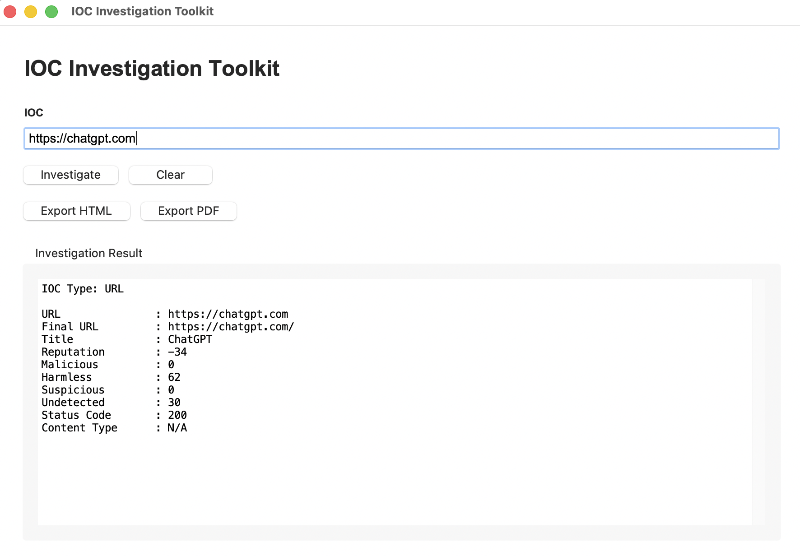

# IOC Investigation Toolkit

IOC Investigation Toolkit is a desktop OSINT investigation tool for analyzing Indicators of Compromise (IOCs).

The application automatically detects the IOC type, queries supported threat-intelligence services, normalizes the returned data, displays the investigation result, and exports reports to HTML or PDF.

The project was originally built as a hands-on software engineering and cybersecurity learning project.

## Preview



---

## Features

### Supported IOC Types

- IPv4 Address
- Domain
- URL
- MD5
- SHA1
- SHA256

### Threat Intelligence Sources

#### IP Address

- VirusTotal
- AbuseIPDB
- Automatic service fallback

#### Domain

- VirusTotal

#### URL

- VirusTotal

#### File Hash

- VirusTotal

### Desktop Application

- Native desktop GUI built with Tkinter
- Automatic IOC type detection
- Background investigation without blocking the GUI
- Investigation status feedback
- Scrollable investigation results
- Enter key shortcut
- Clear / Reset workflow
- Export state management
- Error handling for missing configuration and API failures

### Report Export

Investigation results can be exported to:

- HTML
- PDF

Reports are stored in:

```text
~/Documents/IOC Investigation Toolkit/Reports/
```

---

## Application Workflow

```text
User Input
    │
    ▼
IOC Detection
    │
    ├── IP
    │    ├── VirusTotal
    │    └── AbuseIPDB
    │
    ├── Domain
    │    └── VirusTotal
    │
    ├── URL
    │    └── VirusTotal
    │
    └── Hash
         └── VirusTotal
              │
              ▼
       Normalize Data
              │
              ▼
       Build Investigation Report
              │
       ┌───────┴────────┐
       ▼                ▼
   Desktop GUI       Exporter
                       │
                  ┌────┴────┐
                  ▼         ▼
                HTML        PDF
```

---

## Project Structure

```text
ioc-investigation-toolkit/
│
├── app.py
├── main.py
├── README.md
├── requirements.txt
│
├── assets/
│   ├── app_icon.png
│   └── app_icon.icns
│
├── builders/
│   └── report_builder.py
│
├── core/
│   └── investigator.py
│
├── exporters/
│   ├── html_report.py
│   ├── pdf_report.py
│   └── report_exporter.py
│
├── models/
│   ├── investigation_result.py
│   └── report.py
│
├── presenters/
│   └── console_report.py
│
├── services/
│   ├── abuseipdb.py
│   └── virustotal.py
│
└── utils/
    ├── datetime_utils.py
    ├── ioc_detector.py
    ├── ip_utils.py
    ├── logger.py
    └── path_utils.py
```

---

## Requirements

### Source Version

- Python 3.12+
- VirusTotal API key
- AbuseIPDB API key

Install the Python dependencies with:

```bash
pip install -r requirements.txt
```

---

## API Configuration

The application requires:

```text
VT_API_KEY
ABUSEIPDB_API_KEY
```

### Running from Source

Create a `.env` file in the project root:

```text
VT_API_KEY=your_virustotal_api_key
ABUSEIPDB_API_KEY=your_abuseipdb_api_key
```

The `.env` file is ignored by Git and must never be committed.

### macOS Packaged Application

The standalone macOS application reads its configuration from:

```text
~/.ioc-investigation-toolkit/.env
```

Create the directory:

```bash
mkdir -p ~/.ioc-investigation-toolkit
```

Create:

```text
~/.ioc-investigation-toolkit/.env
```

with:

```text
VT_API_KEY=your_virustotal_api_key
ABUSEIPDB_API_KEY=your_abuseipdb_api_key
```

API keys are intentionally stored outside the application bundle.

---

## Running from Source

Create and activate a virtual environment:

```bash
python3 -m venv .venv
source .venv/bin/activate
```

Install dependencies:

```bash
pip install -r requirements.txt
```

Run the desktop application:

```bash
python app.py
```

The original command-line interface is also available:

```bash
python main.py
```

---

## Building the macOS Application

Install project dependencies first.

Build the application with PyInstaller:

```bash
pyinstaller \
  --clean \
  --noconfirm \
  --windowed \
  --name "IOC Investigation Toolkit" \
  --icon assets/app_icon.icns \
  app.py
```

The application bundle will be created at:

```text
dist/IOC Investigation Toolkit.app
```

To install it locally:

```bash
cp -R \
  "dist/IOC Investigation Toolkit.app" \
  "/Applications/"
```

The application currently targets macOS and has been tested as a standalone application outside the development environment.

---

## Report Storage

HTML and PDF reports generated by the application are stored in:

```text
~/Documents/IOC Investigation Toolkit/Reports/
```

The directory is created automatically when required.

Runtime reports are not stored in the Git repository.

---

## Security

- API keys are not embedded in the application bundle.
- `.env` files are excluded from Git.
- Runtime reports are excluded from Git.
- Build artifacts are excluded from Git.
- API failures are handled without exposing API keys in GUI error messages.
- API keys should be revoked and replaced if they are accidentally exposed.

---

## Architecture

The application separates responsibilities into independent layers:

```text
GUI / CLI
    │
    ▼
Core Investigator
    │
    ├── IOC Detection
    ├── Services
    └── Builders
          │
          ▼
Investigation Result
    │
    ├── Presenter
    └── Report Exporter
```

The core investigation workflow is independent from the desktop interface, allowing other interfaces to reuse the same investigation engine.

---

## Design Principles

- One module should have one clear responsibility.
- External API communication belongs in service modules.
- Normalize external data before presenting it.
- Keep the investigation core independent from the user interface.
- Keep secrets outside source code and application bundles.
- Prefer simple architecture over unnecessary abstraction.
- Validate behavior before optimization.

---

## Development Milestones

- [x] VirusTotal integration
- [x] AbuseIPDB integration
- [x] Multi-source IP investigation
- [x] IOC type detection
- [x] Domain investigation
- [x] URL investigation
- [x] MD5 / SHA1 / SHA256 investigation
- [x] HTML report export
- [x] PDF report export
- [x] Core / presentation separation
- [x] Desktop GUI MVP
- [x] GUI hardening
- [x] Background investigation
- [x] Error handling
- [x] macOS application packaging
- [x] Custom application icon
- [x] External application configuration
- [x] User Documents report storage
- [x] Packaged application regression testing

---

## Current Status

Version: **v1.0.0**

Status: **Stable Release**

Supported platforms:

- macOS

Supported IOC types:

- IP
- Domain
- URL
- MD5
- SHA1
- SHA256

---

## Disclaimer

This project is intended for defensive cybersecurity, OSINT investigation, research, and educational use.

Threat-intelligence results should be treated as investigation context rather than absolute proof that an IOC is malicious or benign.

Users are responsible for complying with the terms of service and usage policies of external intelligence providers.